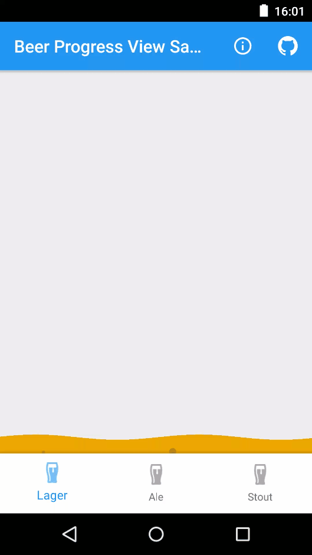

# Beer Progress View
A cool beer styled progress view with realistic bubbles*.  Cheers!

* Increment progress.
* Change beer colour.
* Change wave size.
* Change bubble colour.  

(*realism of the bubbles not guaranteed)

<p>

</p>
  
<!---->

### Setup
To use **BeerProgressView** in your projects, simply add the library as a dependency to your build.

##### Gradle
```
dependencies {
  compile 'uk.co.barbuzz.beerprogressview:beerprogressview:0.0.3'
}
```

##### Maven
```
<dependency>
  <groupId>uk.co.barbuzz.beerprogressview</groupId>
  <artifactId>beerprogressview</artifactId>
  <version>0.0.3</version>
  <type>pom</type>
</dependency>
```

Alternatively you can directly import the /library project into your Android Studio project and add it as a dependency in your build.gradle.

The library is currently configured to be built via Gradle only. It has the following dependencies:

* Nine old androids         - com.nineoldandroids:library:2.4.0
* Compiled SDK Version      - lollipop-23
* Minimum SDK Version       - >= Gingerbread-10

### Usage
For more detailed code example to use the library, Please refer to the `/sample` app.

`BeerProgressView` can be added as a custom view to any layout.

```
<com.sixteenplusfour.beerprogressview.BeerProgressView
        android:id="@+id/beerProgressView"
        android:layout_width="match_parent"
        android:layout_height="match_parent"
        app:beerColor="#EFA601"
        app:bubbleColor="#B67200"
        app:beerProgress="0"
        app:waveMax="100"
        app:waveAmplitude="3dp"/>
```

You can then either set the xml parameters to configure the view or do it programmatically as follows
```
BeerProgressView beerProgressView = (BeerProgressView) findViewById(R.id.beerProgressView);
beerProgressView.setBeerColor(ContextCompat.getColor(mActivity, R.color.lager));
beerProgressView.setBubbleColor(ContextCompat.getColor(mActivity, R.color.lager_bubble));
beerProgressView.setMax(100);
beerProgressView.setAmplitude(4);
beerProgressView.setBeerProgress(10);
```

### TODO
1. Add number of bubbles to xml config?
2. Improve draw efficiency of view

### Thanks

This library has been made by pulling together two other open source libraries to get what I needed at the time. So huge thanks to the following libraries which this is based on.

* WaveProgrssView by [zeng1990java](https://github.com/zeng1990java) - [https://github.com/zeng1990java/WaveProgressView](https://github.com/zeng1990java/WaveProgressView)
* BubbleWallpaper by [vrnvikas](https://github.com/vrnvikas) - [https://github.com/vrnvikas/BubbleWallpaper](https://github.com/vrnvikas/BubbleWallpaper)

### Licence
```
Copyright (c) 2016 Andy Barber

Licensed under the Apache License, Version 2.0 (the "License");
you may not use this file except in compliance with the License.
You may obtain a copy of the License at

  http://www.apache.org/licenses/LICENSE-2.0

Unless required by applicable law or agreed to in writing, software
distributed under the License is distributed on an "AS IS" BASIS,
WITHOUT WARRANTIES OR CONDITIONS OF ANY KIND, either express or implied.
See the License for the specific language governing permissions and
limitations under the License.
```
