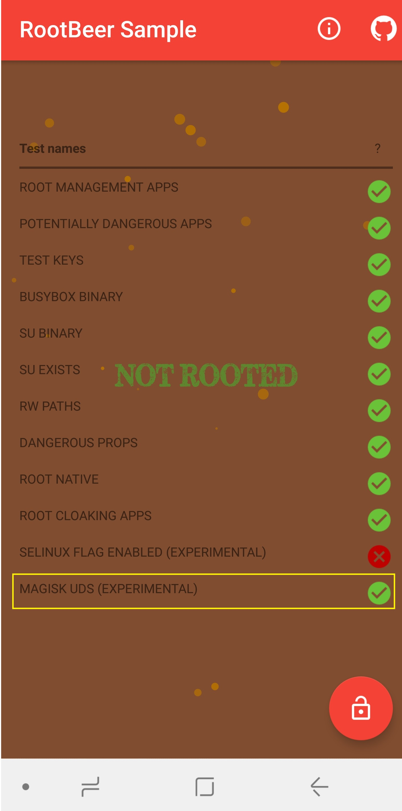

Enjoy the latest Magisk and MagiskHide Detection RootBeerFresh!!
<br/>

RootbeerFresh is an open source project that checks if your Android smartphone device is rooted.

This project is based on rootbeer open source.
There are a number of well-known rooting detection technologies in place.
However, we aim to detect a new rooting device with a completely different technique, completely new.

So, look at the more extensive Android rooting detection project.

Examples of new rooting technologies are those that are extremely difficult to detect for rooted states like Magisk.
Detecting these new rooting technologies is RootbeerFresh's ultimate goal.


*[Google Play app]*
Soon we will launch the RootbeerFresh app.

*[Development environment]*
Builds on the latest Android Studio 3.3 and NDK.

*[contribute]*
If you have a new and better creative way, please leave your PR in any case.

*[Disclaimer and limitations]*
Sometimes the detection method of RootbeerFresh may not work correctly.
When RootbeerFresh is not sure if the device is rooted, it displays a '*' next to the rooted detection message.

[Library]
RootbeerFresh comes with a library.
You can use the library in the following ways:

```java
RootBeer rootBeer = new RootBeer(context);
if (rootBeer.isRooted()) {
    //we found indication of root
} else {
    //we didn't find indication of root
}
```

Note that sometimes the isRooted () method may return false positives.
This is because some device manufacturers release BusyBox in the device's Rom.

If you do not want to detect the BusyBox, use the following example code.

```java
rootBeer.isRootedWithoutBusyBoxCheck()
```

*[Dependency]*

Available on [maven central](https://search.maven.org/#search%7Cga%7C1%7Ca%3A%22rootbeerFresh-lib%22), to include using Gradle just add the following:

```java
dependencies {
    implementation 'kimchangyoun:rootbeerFresh-lib:0.0.9'
}
```

Or use this [Jitpack.io link](https://jitpack.io/#kimchangyoun/rootbeerFresh)

*[Licence]*
Apache License, Version 2.0

    Copyright (C) 2019, ChangYoun Kim

    Licensed under the Apache License, Version 2.0 (the "License");
    you may not use this file except in compliance with the License.
    You may obtain a copy of the License at

         http://www.apache.org/licenses/LICENSE-2.0

    Unless required by applicable law or agreed to in writing, software
    distributed under the License is distributed on an "AS IS" BASIS,
    WITHOUT WARRANTIES OR CONDITIONS OF ANY KIND, either express or implied.
    See the License for the specific language governing permissions and
    limitations under the License.
